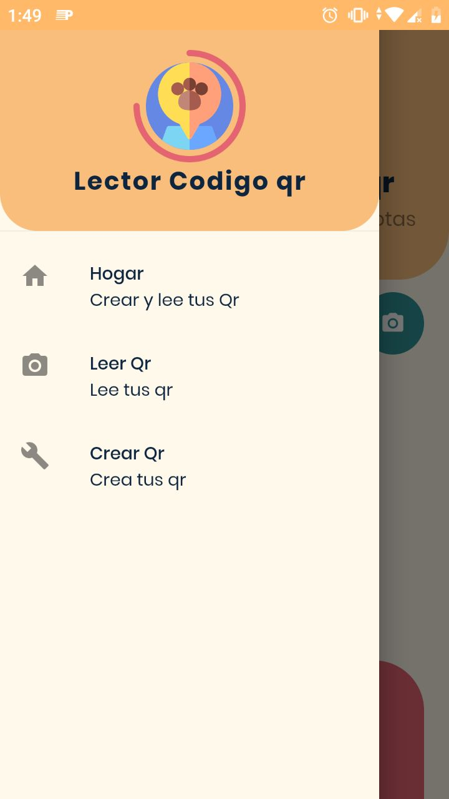
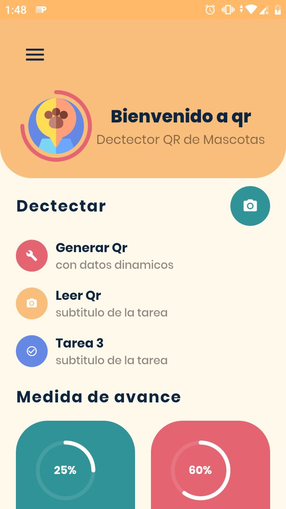

## Flutter Qr App

This app is static. I mean, This is a UI design. No backend.

## Screenshots

## Pull Requests

I welcome and encourage all pull requests. It usually will take me within 24-48 hours to respond to any issue or request.

## Getting Started

A few resources to get started if this is your first Flutter project:

- [CodeLab: Write your first Flutter app](https://flutter.dev/docs/get-started/codelab)
- [Cookbook: Useful Flutter samples](https://flutter.dev/docs/cookbook)

For help getting started with Flutter, view
[online documentation](https://flutter.dev/docs), which offers tutorials,
samples, guidance on mobile development, and a full API reference.
